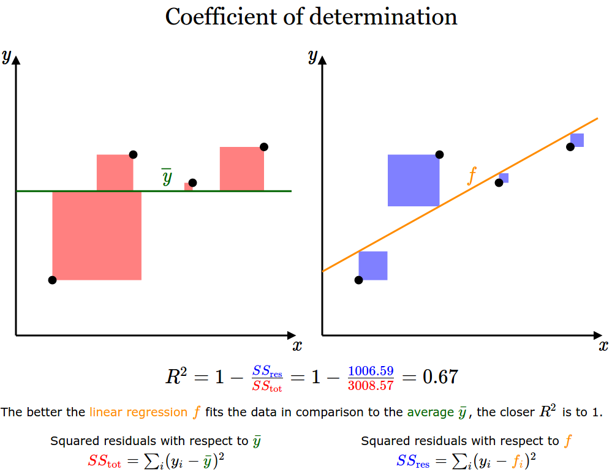

Understand R²
=============
Visualization of the coefficient of determination (R²)

Interactive Version of [this image](  https://en.wikipedia.org/wiki/Coefficient_of_determination#/media/File:Coefficient_of_Determination.svg) from wikipedia. Click to add points and drag them. Try it here: http://alexander-n.github.io/r-squared/

